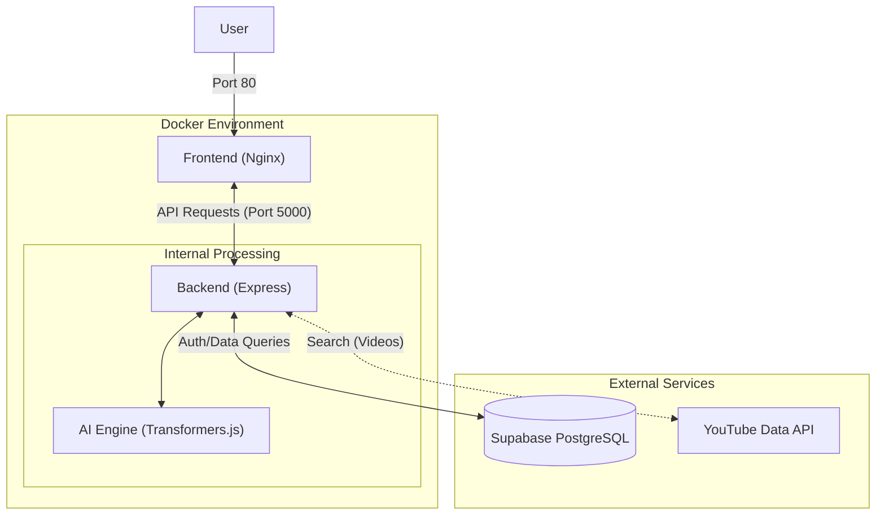

# System Design Layout

This document details the system architecture for the "compAnIon" application.

## 1. High-Level Architecture
The application follows a standard Client-Server architecture, containerized with Docker for consistent deployment.



## 2. Technology Stack

### Frontend (Client)
- **Framework**: React (v18) with Vite for build tooling.
- **Language**: TypeScript.
- **Styling**: TailwindCSS for utility-first styling.
- **Visuals**: Three.js (via `three` package) for 3D elements, Chart.js for data visualization.
- **State/Routing**: React Router DOM (v6).
- **HTTP Client**: Axios.
- **Deployment**: containerized via Nginx.

### Backend (Server)
- **Runtime**: Node.js (v20).
- **Framework**: Express.js.
- **Language**: TypeScript.
- **Database Connector**: `pg` (node-postgres).
- **AI/ML**: `@xenova/transformers` (running locally/in-process) for sentiment analysis.
- **Deployment**: containerized Node.js environment.

### Database
- **Provider**: Supabase.
- **Type**: PostgreSQL relational database.
- **Key Tables**:
    - `users`: Stores user credentials and profile data.
    - `journalentries`: Stores user journals + sentiment analysis results.

## 3. Core Components & Responsibilities

### Authentication System
- **Custom Implementation**: Uses `bcrypt` for secure password hashing and `jsonwebtoken` for stateless session management.
- **Components**:
    - `bcrypt`: Hashes passwords before storing in Supabase.
    - `jwtGenerator`: Issues signed tokens upon successful login/registration.
- Endpoints: `/auth/register`, `/auth/login`, `/auth/verify`.
- Middleware: `jwtAuth` protects private routes.

### Dashboard & Journaling
- **Journal Entry Creation**:
    1. User submits text via Client.
    2. Server receives text.
    3. Server runs `analyseSentiment(text)` locally using Transformers.js.
    4. Sentiment Label (e.g., "POSITIVE") and Score are saved to DB along with text.
- **Progress Tracking**: Fetches historical mood scores to visualize user well-being over time.

### Resource Recommendations
- **YouTube Integration**:
    1. User requests resources.
    2. Server generates a search query using a local `distilgpt2` model.
    3. Server calls YouTube Data API to find relevant educational videos.
    4. Returns video ID to client for embedding.

### AI Engine (Local)
- Unlike traditional setups calling external OpenAI APIs, this project runs a quantized sentiment analysis model *inside* the Node.js process using `@xenova/transformers`.
- **Benefit**: Zero latency overhead for network calls to AI providers; privacy-preserving (data stays on server).

## 4. Docker Support

The application is fully containerized using Docker and Docker Compose.

### Prerequisites
- [Docker Desktop](https://www.docker.com/products/docker-desktop/)
- [Docker Compose](https://docs.docker.com/compose/install/)

### Quick Start

1. **Environment Setup**:
   Ensure you have a `.env` file in the `server/` directory with your Supabase and YouTube credentials.

2. **Run with Docker Compose**:
   From the root directory, run:
   ```bash
   docker-compose up --build
   ```

3. **Access the App**:
   - **Frontend**: [http://localhost](http://localhost) (Port 80)
   - **Backend**: [http://localhost:5000](http://localhost:5000)

### Container Architecture
- **Frontend Container**: Uses a multi-stage build. First builds the React app, then serves the static assets using Nginx.
- **Backend Container**: Built on `node:20-slim`. Includes `libgomp1` to support ONNX runtime for local AI inference.

## 5. Data Flow Example: Creating a Journal Entry

1. **Client**: User types "I felt great today!" and clicks Submit.
2. **Client**: Sends `POST /dashboard/journalentry` with Bearer Token.
3. **Server (Middleware)**: Verifies JWT. If valid, attaches `user.id` to request.
4. **Server (Controller)**:
    - Calls `analyseSentiment("I felt great today!")`.
    - AI Engine returns `{ label: 'POSITIVE', score: 0.99 }`.
5. **Server (DB)**: Executes SQL `INSERT INTO journalentries ...`.
6. **Database**: Stores row, generates UUID, returns new entry.
7. **Server**: Responds to Client with created entry.
8. **Client**: Updates UI to show new entry in the list.
